<p align="center">
  
</p>

# LigneClaire

Local-first creative coding framework for pen plotters.

The repo is organized around a shared TypeScript engine, a thin Node runtime/CLI, a Vite + React studio, and checked-in plot programs under `programs/`. The canonical product contract lives in [spec.md](/workspaces/ligneclaire/spec.md).

## Best In Ona

LigneClaire is best run in Ona. The checked-in Dev Container and Ona automation start the studio stack in a reproducible environment and expose the browser workspace with the intended port and access settings.

[](https://app.ona.com/#https://github.com/csweichel/ligneclaire)

## Workspace

- `apps/studio`: React + Vite + Tailwind studio UI.
- `packages/engine`: plot document model, parameter normalization, SVG serialization, metrics, and geometry helpers.
- `packages/sdk`: `defineProgram`, typed parameter builders, editor contracts, and validation helpers.
- `packages/ui`: shared studio components.
- `packages/node-runtime`: filesystem IO, registry access, render/export APIs, and tool diagnostics.
- `packages/cli`: non-interactive CLI commands.
- `programs/`: trusted in-repo plot programs and parameter sets.

## Commands

```bash
pnpm install --frozen-lockfile
pnpm generate:gallery
pnpm generate:registry
pnpm typecheck
pnpm test
pnpm build
pnpm lc list-programs
pnpm runtime
pnpm studio
```

## Sample Gallery

Regenerate the checked-in render gallery and this section with `pnpm generate:gallery`.

<!-- SAMPLE_GALLERY:START -->

Rendered 19 checked-in programs across 27 parameter sets.

Each thumbnail links to the checked-in SVG export committed under `docs/gallery/`.

### Clipped Field

`clip-field` - A dense Perlin field with a clean polygonal void cut through its center.

<table>
  <tr>
    <td align="center" valign="top">
      <a href="./docs/gallery/clip-field/default.svg">
        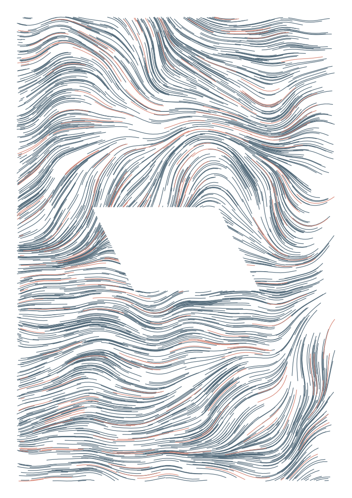
      </a>
    </td>
  </tr>
  <tr>
    <td align="center" valign="top">
      <strong>Default</strong><br />
      <code>default</code><br />
      2,297 paths<br />
      121,764 segments<br />
      50.7 m draw distance
    </td>
  </tr>
</table>

### Continuous Contour

`continuous-contour` - The poster-style continuous contour composition from go-pen.

<table>
  <tr>
    <td align="center" valign="top">
      <a href="./docs/gallery/continuous-contour/default.svg">
        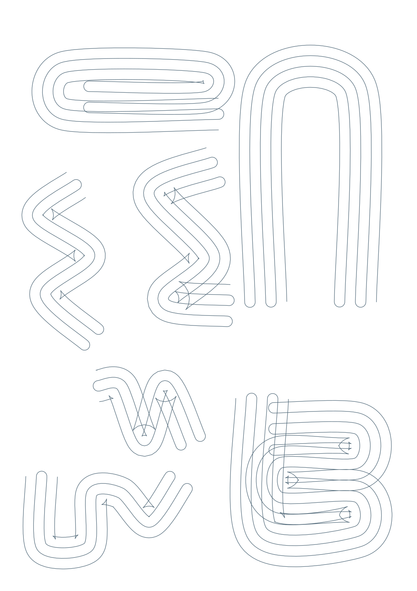
      </a>
    </td>
  </tr>
  <tr>
    <td align="center" valign="top">
      <strong>Default</strong><br />
      <code>default</code><br />
      7 paths<br />
      6,174 segments<br />
      9.7 m draw distance
    </td>
  </tr>
</table>

### Continuous And Discrete Curve

`curve` - The go-pen curve example: a sampled sine wave overlaid with a simple discrete data polygon.

<table>
  <tr>
    <td align="center" valign="top">
      <a href="./docs/gallery/curve/default.svg">
        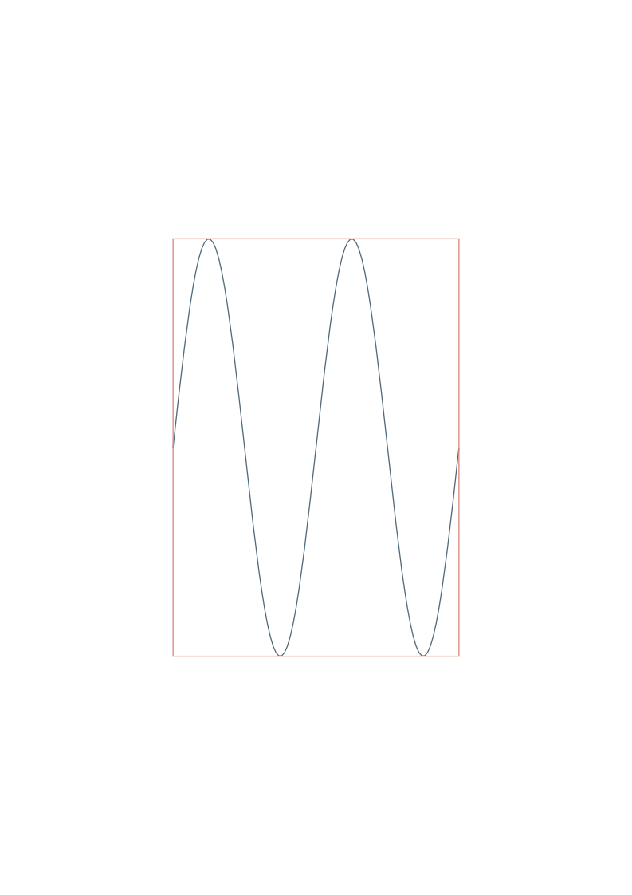
      </a>
    </td>
  </tr>
  <tr>
    <td align="center" valign="top">
      <strong>Default</strong><br />
      <code>default</code><br />
      2 paths<br />
      104 segments<br />
      1.0 m draw distance
    </td>
  </tr>
</table>

### Perlin Field

`field` - Flow-field traces sampled from a deterministic Perlin vector grid.

<table>
  <tr>
    <td align="center" valign="top">
      <a href="./docs/gallery/field/default.svg">
        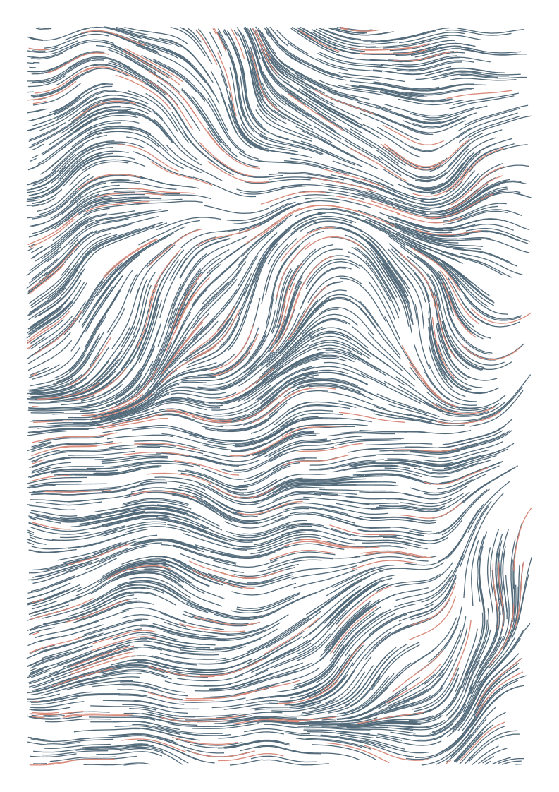
      </a>
    </td>
  </tr>
  <tr>
    <td align="center" valign="top">
      <strong>Default</strong><br />
      <code>default</code><br />
      2,386 paths<br />
      133,236 segments<br />
      55.5 m draw distance
    </td>
  </tr>
</table>

### Hello World

`hello-world` - The original go-pen fan study: two mirrored sprays of long lines crossing the page.

<table>
  <tr>
    <td align="center" valign="top">
      <a href="./docs/gallery/hello-world/default.svg">
        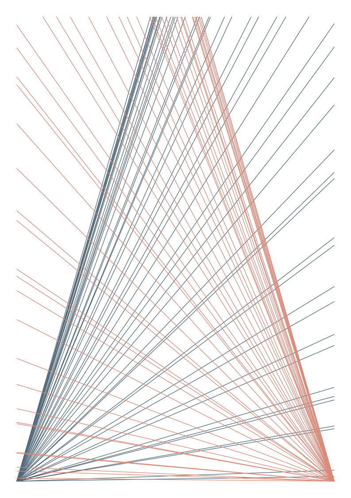
      </a>
    </td>
  </tr>
  <tr>
    <td align="center" valign="top">
      <strong>Default</strong><br />
      <code>default</code><br />
      96 paths<br />
      96 segments<br />
      26.0 m draw distance
    </td>
  </tr>
</table>

### Hilbert Density

`hilbert-density` - A Hilbert curve with locally thickened segments driven by stripes, noise, and center bias.

<table>
  <tr>
    <td align="center" valign="top">
      <a href="./docs/gallery/hilbert-density/default.svg">
        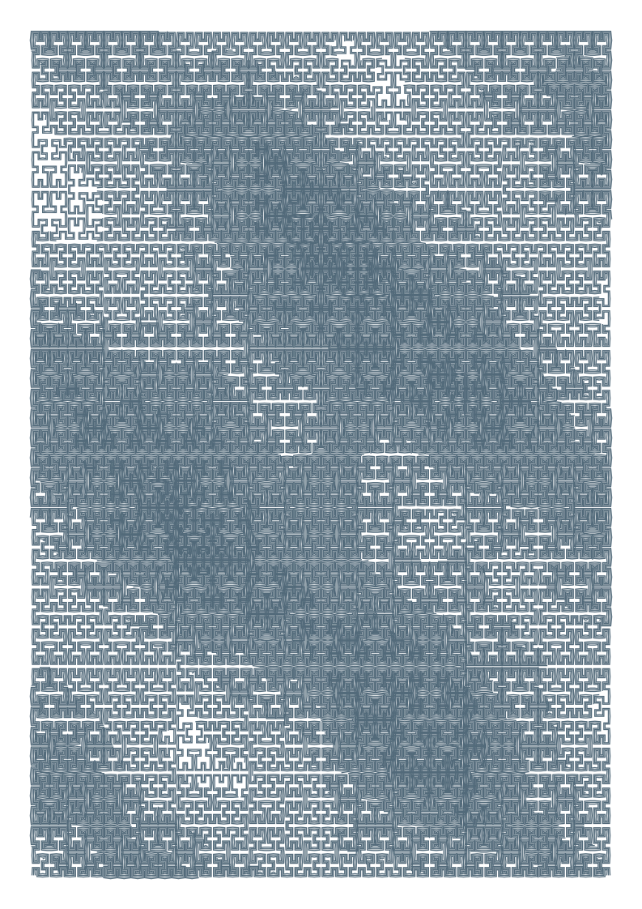
      </a>
    </td>
  </tr>
  <tr>
    <td align="center" valign="top">
      <strong>Default</strong><br />
      <code>default</code><br />
      505 paths<br />
      70,905 segments<br />
      130.5 m draw distance
    </td>
  </tr>
</table>

### Hilbert Loops Gradient

`hilbert-loops-gradient` - Nested Hilbert loops that thicken towards the shared center mass.

<table>
  <tr>
    <td align="center" valign="top">
      <a href="./docs/gallery/hilbert-loops-gradient/default.svg">
        
      </a>
    </td>
  </tr>
  <tr>
    <td align="center" valign="top">
      <strong>Default</strong><br />
      <code>default</code><br />
      1,293 paths<br />
      150,083 segments<br />
      580.0 m draw distance
    </td>
  </tr>
</table>

### Hilbert Thick Gradient

`hilbert-thick-gradient` - A landscape Hilbert curve thickened by an inside-out center gradient.

<table>
  <tr>
    <td align="center" valign="top">
      <a href="./docs/gallery/hilbert-thick-gradient/default.svg">
        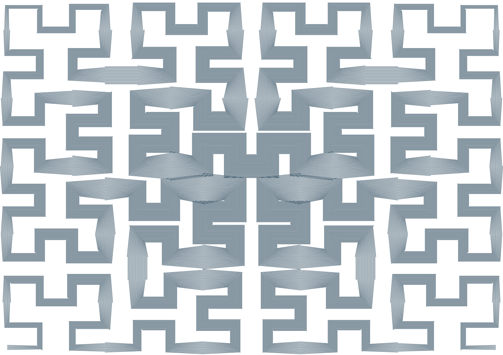
      </a>
    </td>
    <td align="center" valign="top">
      <a href="./docs/gallery/hilbert-thick-gradient/sparse.svg">
        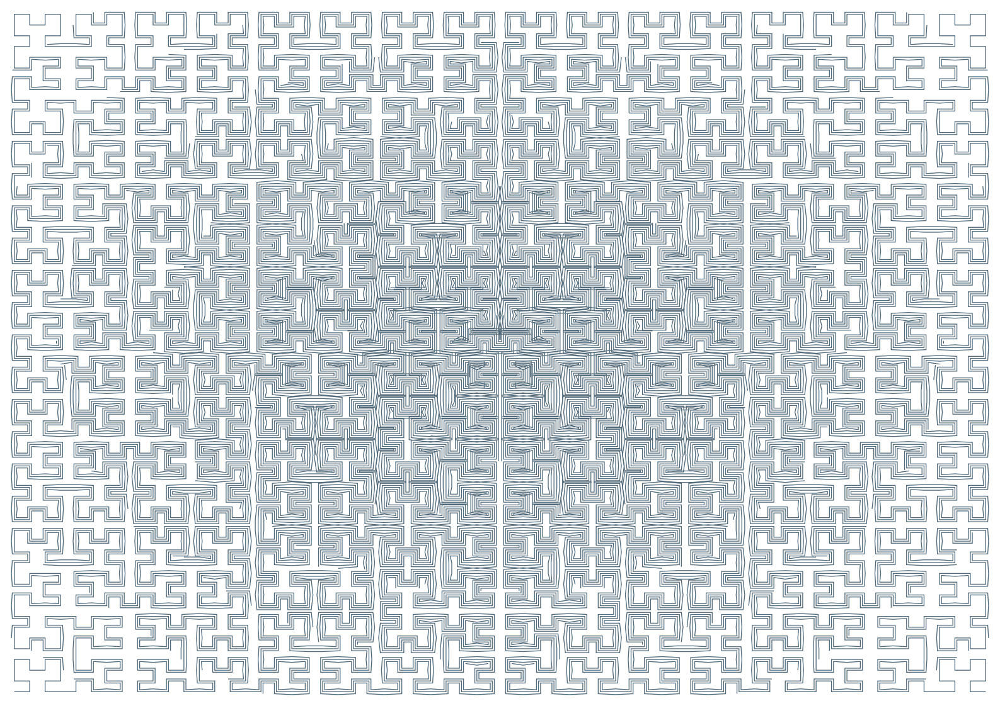
      </a>
    </td>
  </tr>
  <tr>
    <td align="center" valign="top">
      <strong>Default</strong><br />
      <code>default</code><br />
      217 paths<br />
      5,199 segments<br />
      120.8 m draw distance
    </td>
    <td align="center" valign="top">
      <strong>Sparse</strong><br />
      <code>sparse</code><br />
      148 paths<br />
      16,946 segments<br />
      93.6 m draw distance
    </td>
  </tr>
</table>

### Image Circles

`image-circles` - A sampled grayscale image rendered as hatched circles.

<table>
  <tr>
    <td align="center" valign="top">
      <a href="./docs/gallery/image-circles/default.svg">
        
      </a>
    </td>
  </tr>
  <tr>
    <td align="center" valign="top">
      <strong>Default</strong><br />
      <code>default</code><br />
      21,180 paths<br />
      312,204 segments<br />
      185.0 m draw distance
    </td>
  </tr>
</table>

### Image Jiggle

`image-jiggle` - A raster-derived sine jiggle field whose local frequency and amplitude follow image darkness.

<table>
  <tr>
    <td align="center" valign="top">
      <a href="./docs/gallery/image-jiggle/default.svg">
        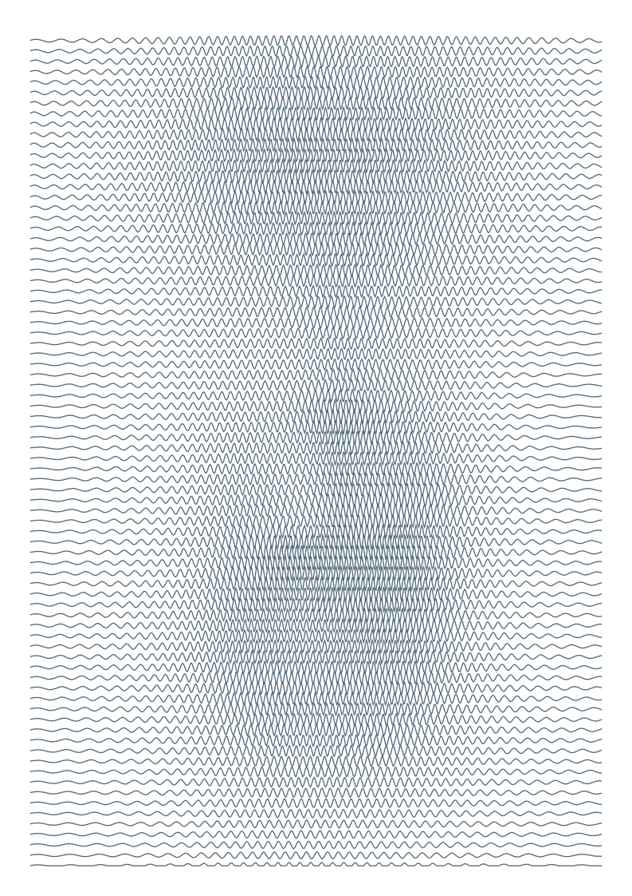
      </a>
    </td>
  </tr>
  <tr>
    <td align="center" valign="top">
      <strong>Default</strong><br />
      <code>default</code><br />
      80 paths<br />
      48,000 segments<br />
      34.0 m draw distance
    </td>
  </tr>
</table>

### Isometric Ribbons

`isometric-ribbons` - A dense field of offset isometric staircase curves, arranged on a staggered lattice to echo woven blue ribbon studies.

<table>
  <tr>
    <td align="center" valign="top">
      <a href="./docs/gallery/isometric-ribbons/default.svg">
        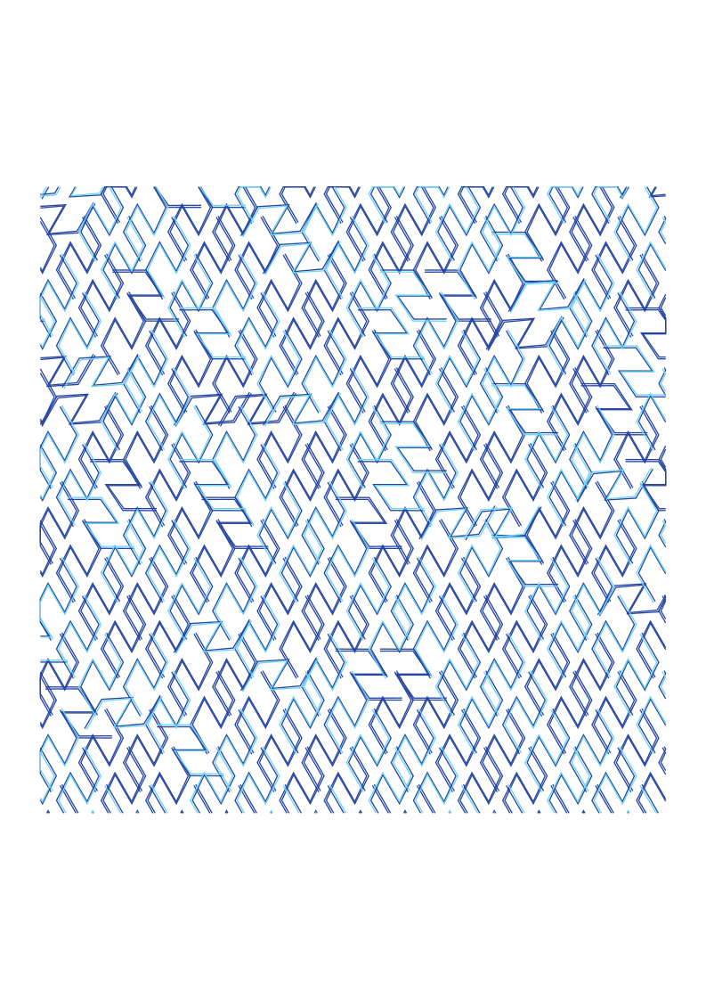
      </a>
    </td>
  </tr>
  <tr>
    <td align="center" valign="top">
      <strong>Default</strong><br />
      <code>default</code><br />
      586 paths<br />
      2,532 segments<br />
      22.0 m draw distance
    </td>
  </tr>
</table>

### Logo Field

`logo` - A compact flow field clipped into the original go-pen logo mark.

<table>
  <tr>
    <td align="center" valign="top">
      <a href="./docs/gallery/logo/default.svg">
        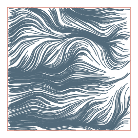
      </a>
    </td>
  </tr>
  <tr>
    <td align="center" valign="top">
      <strong>Default</strong><br />
      <code>default</code><br />
      955 paths<br />
      44,262 segments<br />
      18.6 m draw distance
    </td>
  </tr>
</table>

### Node Composer

`node-composer` - Build plot images from reusable generators, masks, processing nodes, and multi-layer outputs.

<table>
  <tr>
    <td align="center" valign="top">
      <a href="./docs/gallery/node-composer/default.svg">
        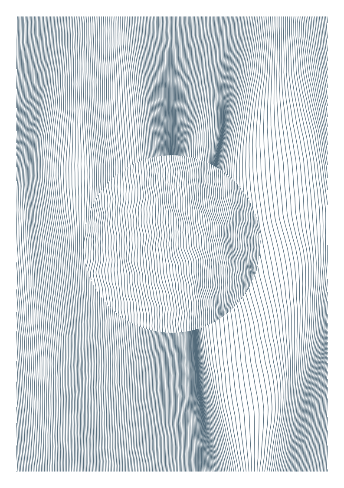
      </a>
    </td>
    <td align="center" valign="top">
      <a href="./docs/gallery/node-composer/four-hills.svg">
        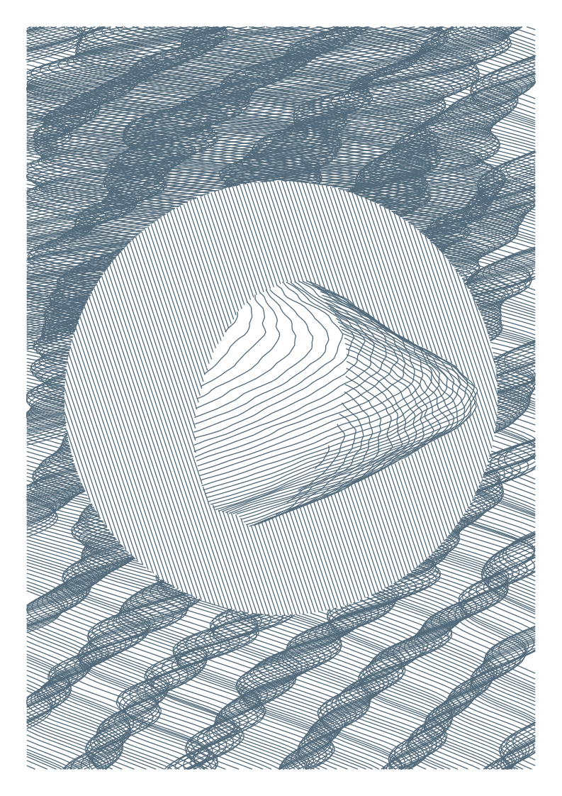
      </a>
    </td>
  </tr>
  <tr>
    <td align="center" valign="top">
      <strong>Default</strong><br />
      <code>default</code><br />
      441 paths<br />
      59,722 segments<br />
      48.4 m draw distance
    </td>
    <td align="center" valign="top">
      <strong>Four Hills</strong><br />
      <code>four-hills</code><br />
      1,297 paths<br />
      24,509 segments<br />
      100.2 m draw distance
    </td>
  </tr>
</table>

### Reference Poster

`reference-poster` - The large-format reference poster composition from go-pen.

<table>
  <tr>
    <td align="center" valign="top">
      <a href="./docs/gallery/reference-poster/default.svg">
        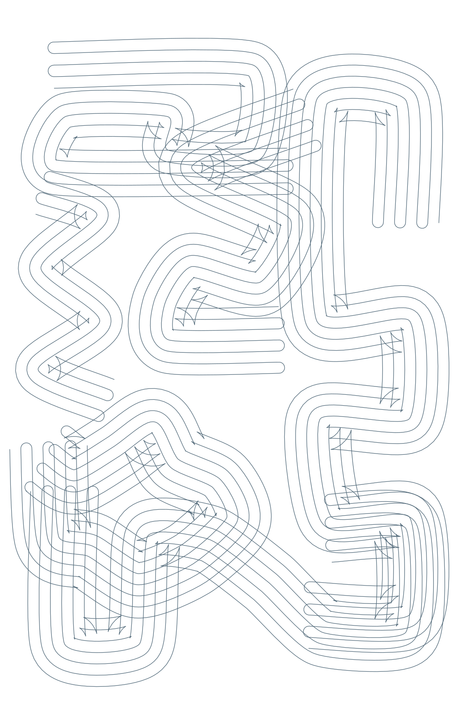
      </a>
    </td>
  </tr>
  <tr>
    <td align="center" valign="top">
      <strong>Default</strong><br />
      <code>default</code><br />
      6 paths<br />
      13,860 segments<br />
      19.7 m draw distance
    </td>
  </tr>
</table>

### Sculpture Scan

`sculpture-scan` - Vertical scan lines laterally displaced by a smooth sculpting field to suggest a carved surface.

<table>
  <tr>
    <td align="center" valign="top">
      <a href="./docs/gallery/sculpture-scan/default.svg">
        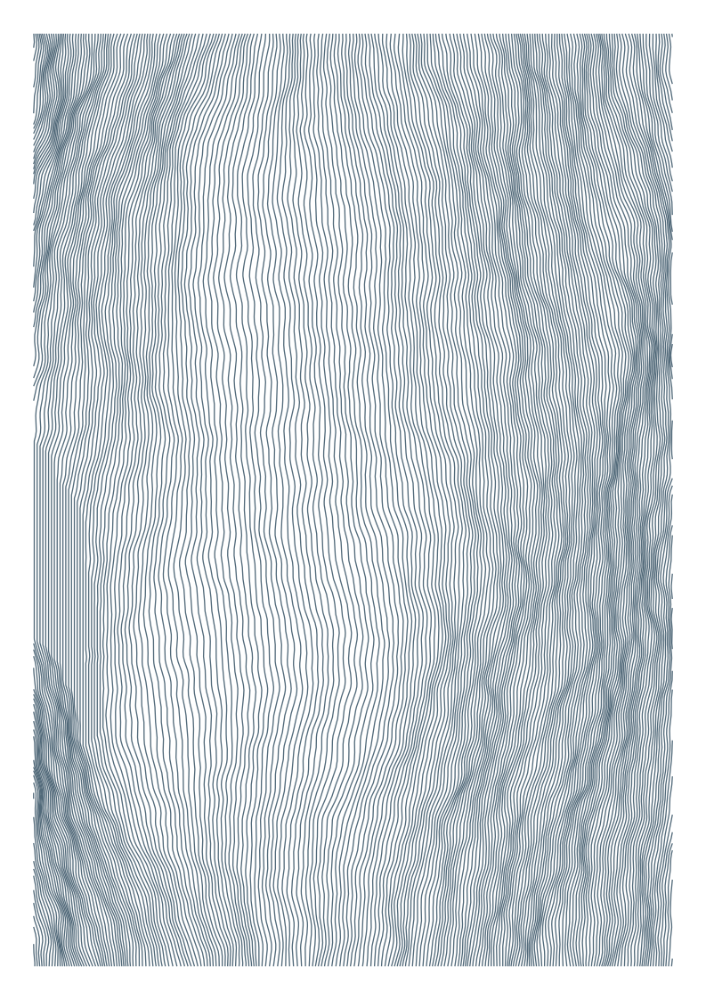
      </a>
    </td>
  </tr>
  <tr>
    <td align="center" valign="top">
      <strong>Default</strong><br />
      <code>default</code><br />
      267 paths<br />
      107,109 segments<br />
      54.4 m draw distance
    </td>
  </tr>
</table>

### Terrain Slice

`terrain-slices` - A single isometric terrain slice with lifted linework rising through a water plane.

<table>
  <tr>
    <td align="center" valign="top">
      <a href="./docs/gallery/terrain-slices/default.svg">
        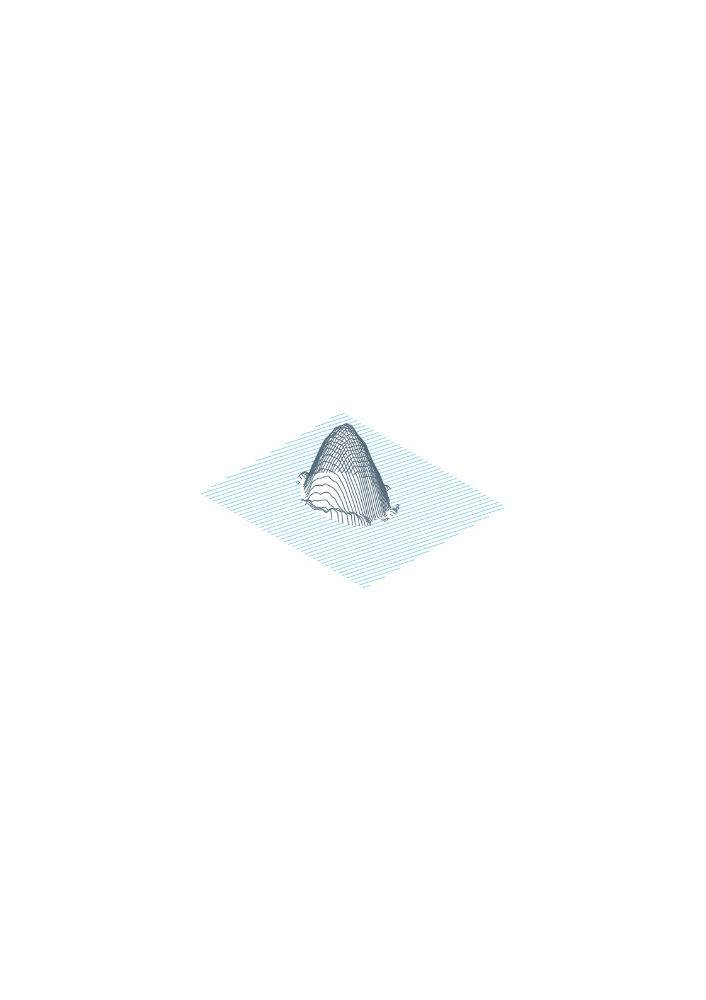
      </a>
    </td>
  </tr>
  <tr>
    <td align="center" valign="top">
      <strong>Default</strong><br />
      <code>default</code><br />
      147 paths<br />
      1,735 segments<br />
      4.3 m draw distance
    </td>
  </tr>
</table>

### Tilepath Grid

`tilepath-grid` - A routed arc-and-line tile field with cell-level studio overrides.

<table>
  <tr>
    <td align="center" valign="top">
      <a href="./docs/gallery/tilepath-grid/curls.svg">
        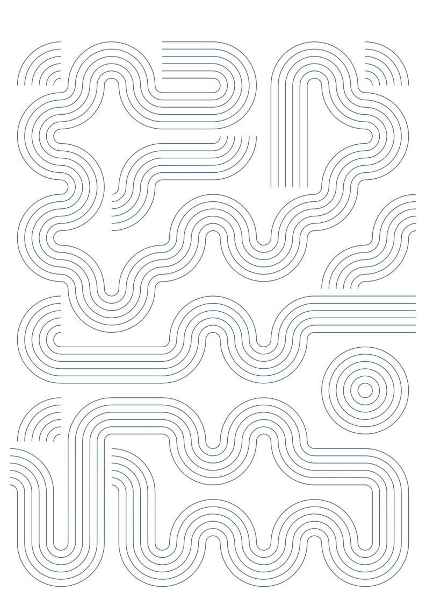
      </a>
    </td>
    <td align="center" valign="top">
      <a href="./docs/gallery/tilepath-grid/default.svg">
        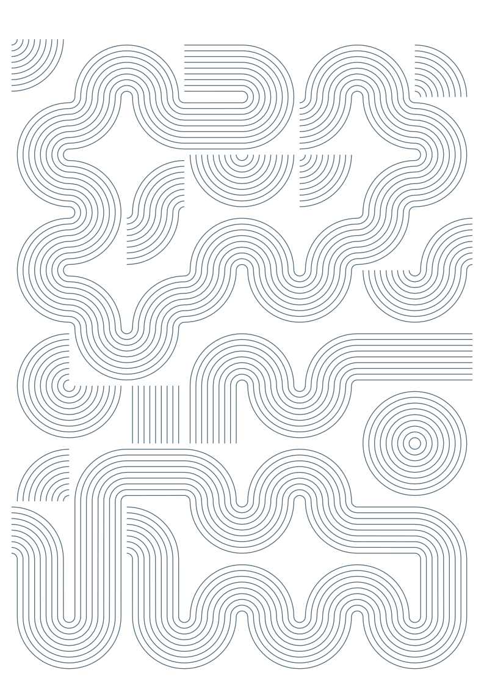
      </a>
    </td>
  </tr>
  <tr>
    <td align="center" valign="top">
      <strong>Curls</strong><br />
      <code>curls</code><br />
      54 paths<br />
      7,872 segments<br />
      10.9 m draw distance
    </td>
    <td align="center" valign="top">
      <strong>Default</strong><br />
      <code>default</code><br />
      117 paths<br />
      12,267 segments<br />
      16.2 m draw distance
    </td>
  </tr>
</table>

### Trochoid Figure

`trochoid` - Place and independently tune multiple hypotrochoid or epitrochoid figures on the sheet.

<table>
  <tr>
    <td align="center" valign="top">
      <a href="./docs/gallery/trochoid/default.svg">
        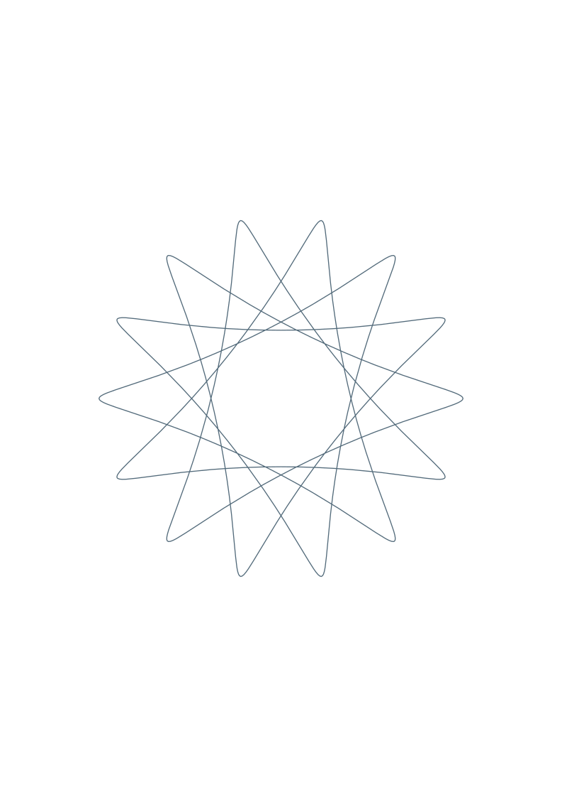
      </a>
    </td>
    <td align="center" valign="top">
      <a href="./docs/gallery/trochoid/large.svg">
        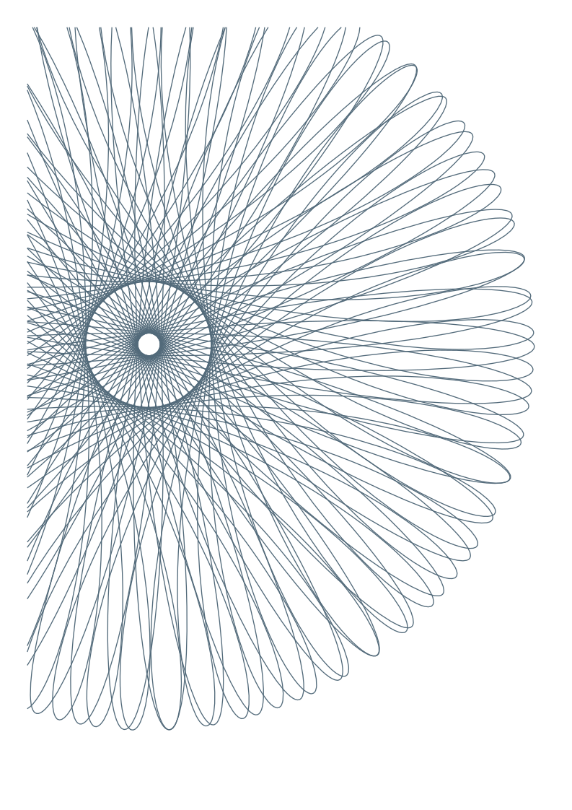
      </a>
    </td>
    <td align="center" valign="top">
      <a href="./docs/gallery/trochoid/untitled.svg">
        
      </a>
    </td>
  </tr>
  <tr>
    <td align="center" valign="top">
      <strong>Default</strong><br />
      <code>default</code><br />
      1 paths<br />
      1,600 segments<br />
      1.7 m draw distance
    </td>
    <td align="center" valign="top">
      <strong>Large</strong><br />
      <code>large</code><br />
      65 paths<br />
      10,297 segments<br />
      25.2 m draw distance
    </td>
    <td align="center" valign="top">
      <strong>Untitled</strong><br />
      <code>untitled</code><br />
      1 paths<br />
      1,600 segments<br />
      1.7 m draw distance
    </td>
  </tr>
</table>

### Focused Waves

`waves` - Two-layer wave bands shaped by a draggable focal point and a soft falloff field.

<table>
  <tr>
    <td align="center" valign="top">
      <a href="./docs/gallery/waves/default.svg">
        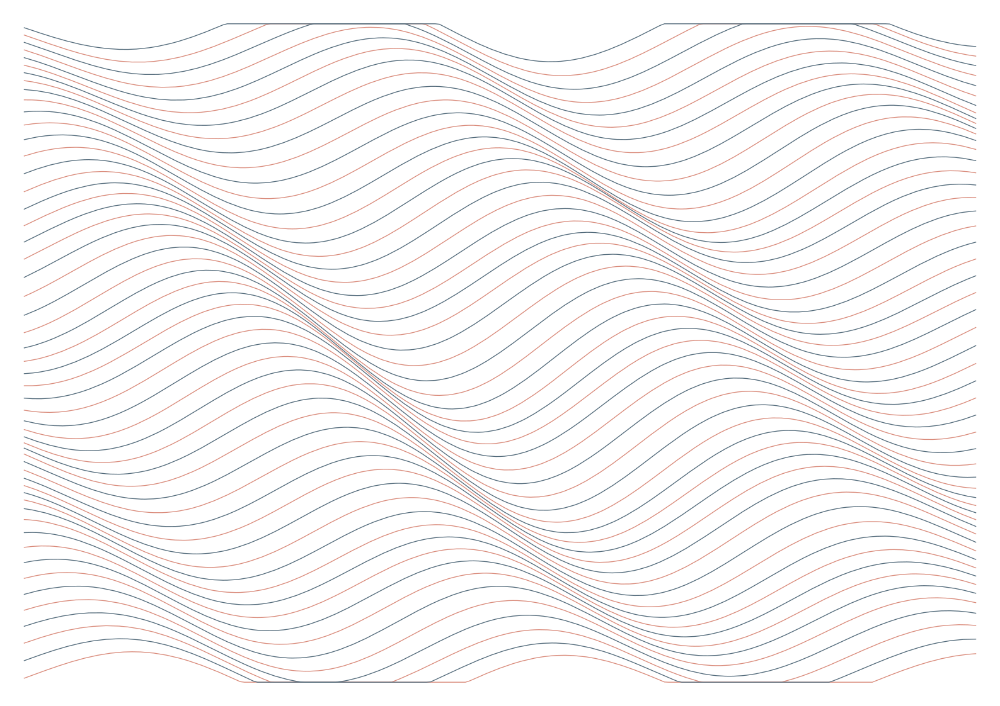
      </a>
    </td>
    <td align="center" valign="top">
      <a href="./docs/gallery/waves/dense-a3.svg">
        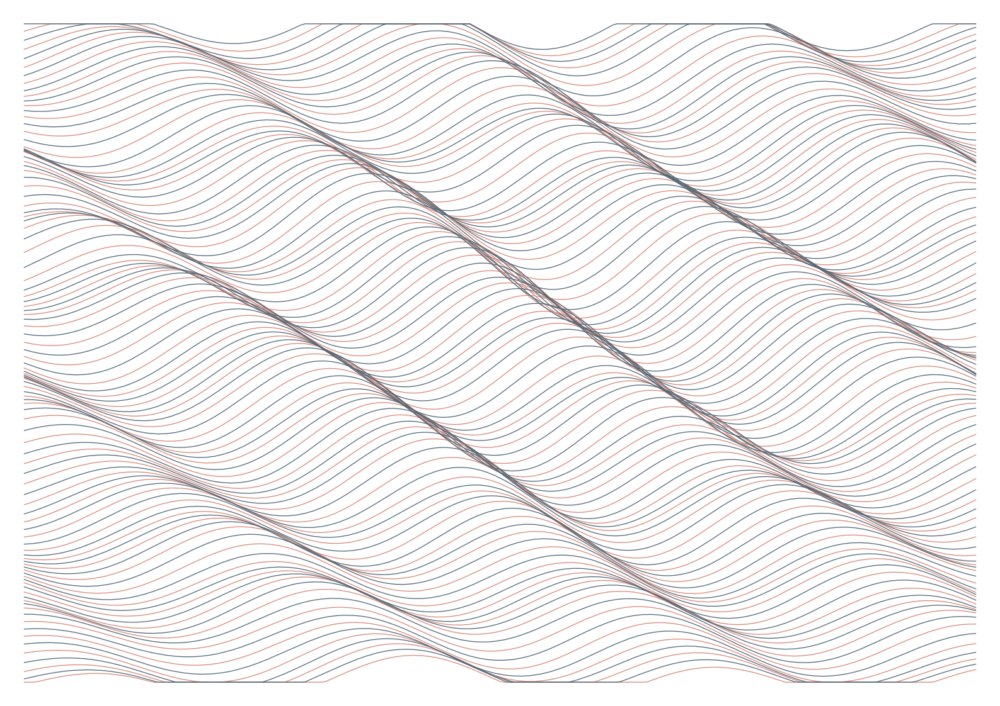
      </a>
    </td>
    <td align="center" valign="top">
      <a href="./docs/gallery/waves/density.svg">
        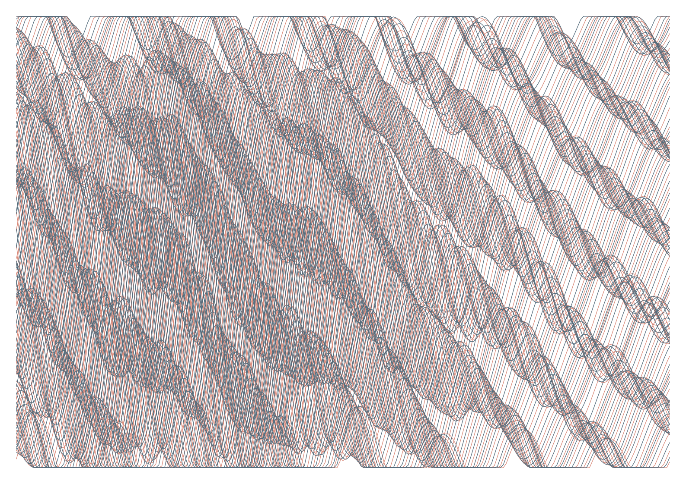
      </a>
    </td>
  </tr>
  <tr>
    <td align="center" valign="top">
      <strong>Default</strong><br />
      <code>default</code><br />
      54 paths<br />
      11,880 segments<br />
      23.3 m draw distance
    </td>
    <td align="center" valign="top">
      <strong>Dense A3</strong><br />
      <code>dense-a3</code><br />
      108 paths<br />
      23,760 segments<br />
      47.1 m draw distance
    </td>
    <td align="center" valign="top">
      <strong>Density</strong><br />
      <code>density</code><br />
      180 paths<br />
      39,600 segments<br />
      233.5 m draw distance
    </td>
  </tr>
</table>

<table>
  <tr>
    <td align="center" valign="top">
      <a href="./docs/gallery/waves/ocean.svg">
        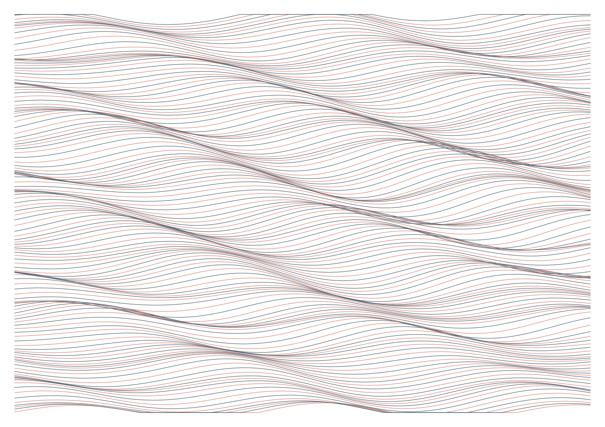
      </a>
    </td>
  </tr>
  <tr>
    <td align="center" valign="top">
      <strong>Ocean</strong><br />
      <code>ocean</code><br />
      146 paths<br />
      32,120 segments<br />
      59.2 m draw distance
    </td>
  </tr>
</table>


<!-- SAMPLE_GALLERY:END -->

## Ona Automation

The repo includes an Ona automation service at `.ona/automations.yaml`.

```bash
ona automations validate .ona/automations.yaml
ona automations update .ona/automations.yaml -s
ona automations service start studio
```

The `studio` service starts the local runtime plus the Vite studio and opens port `5173` with `creator_only` admission so only the environment owner can access it. It is configured to auto-start with the `postDevcontainerStart` automation trigger once the environment has loaded `.ona/automations.yaml`.

## Notes

- Dependencies are pinned exactly via `.npmrc` and `pnpm-lock.yaml`.
- Program discovery is generated, not arbitrary runtime directory execution.
- The browser app never touches the filesystem directly; all persistence and exports flow through the Node runtime.
